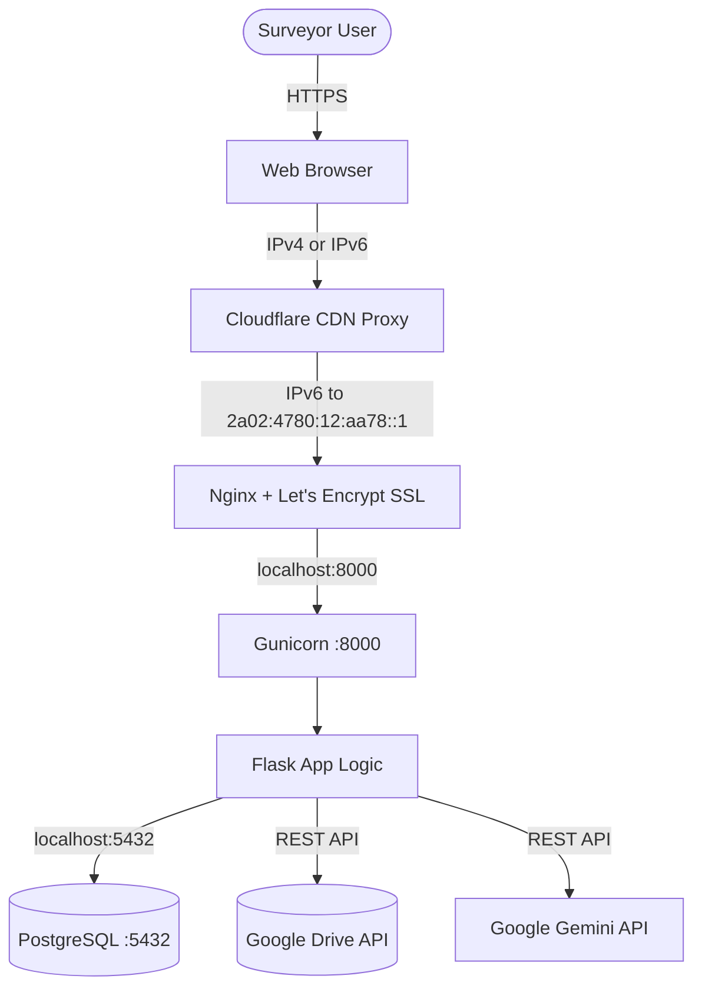

# Project Context: Motor Survey Report Generator

This document provides a comprehensive technical overview of the **Motor Survey Report Generator** application. It describes the complete software stack, database schema, file layout, dynamic AI model integration, current production deployment infrastructure, and maintenance procedures.

---

## 1. System Architecture Overview

The Motor Survey Report Generator is a multi-user, web-based tool designed for insurance surveyors. It streamlines the creation of survey reports by automatically parsing insurance claims documents, parts invoices, and vehicle photographs using Gemini AI, generating consolidated PDFs, and storing structured records.



---

## 2. Technical Stack Details

### Frontend Layer
* **Tech Stack:** HTML5, CSS3 (Vanilla), JavaScript (ES6+).
* **Styling Framework:** Custom responsive layout styled inside `static/style.css`.
* **Icons:** Font Awesome v6.4.0 (CDN-loaded).
* **Pages:**
  * `login.html`: Secure user authentication page.
  * `index.html`: Main dashboard page. Contains:
    * Reports list table (paginated search, sort, and status toggles).
    * Core Survey Report Entry forms (Surveyor profile, claim details, policy information, vehicle descriptors).
    * Vehicle parts tables (Metal, Plastic, Glass, Endorsement tables with automatic depreciation and salvage calculations).
    * Media uploading component (invoice and vehicle photograph selectors).
    * Surveyor Profile and Dynamic Settings modals.
* **Client-Side Scripts:**
  * `static/script.js` handles form states, dynamic table insertions, real-time calculations (depreciation percentages, VAT/GST additions, salvage values), uploads via Drive resumable URLs, and dynamic model lists population on opening settings.

### Backend Layer
* **Tech Stack:** Python Flask (v3.1.0).
* **WSGI Server:** Gunicorn (v23.0.0) configured with 3 workers, bound to `127.0.0.1:8000`.
* **Process Monitor:** Systemd service (`insurance.service`).
* **Web Server:** Nginx (v1.24) acting as a local reverse proxy (routing requests from port 80/443 to Gunicorn port `8000` and serving `/static/` assets directly with a 30-day cache control).
* **Security Controls:**
  * **Flask-Login (v0.6.3):** Manages user session state and secure HTTP-Only/SameSite session cookies.
  * **Flask-Bcrypt (v1.0.1):** Secure password hashing using salt rounds.
  * **Flask-Limiter (v3.8.0):** Limits brute force attacks (rate-limits endpoints to 200/day, 50/hour).
  * **File Upload Limits:** Configured up to 100MB (`MAX_CONTENT_LENGTH`).

### Database Layer
* **Database Engine:** PostgreSQL (local instance on Port 5432).
* **Connection Client:** `psycopg2-binary` (v2.9.9).
* **VPS Database Credentials:**
  * Host: `127.0.0.1`, Port: `5432`
  * Database: `insurance_db`
  * User: `insurance_user`
  * Password: `surveyorportal@2026`
* **Tables:**
  1. `users` Table:
     * `id` (SERIAL PRIMARY KEY)
     * `username` (VARCHAR(255) UNIQUE) — User login credential.
     * `password_hash` (VARCHAR(255)) — Bcrypt password hash.
     * Profile Metadata: `full_name`, `qualifications`, `designation`, `license_no`, `expiry_date`, `membership_no`, `address_line_1`, `address_line_2`, `address_line_3`, `contact_no`, `email`.
     * Dynamic settings: `gemini_api_key` (VARCHAR(255)) & `gemini_model` (VARCHAR(255)) which store user-specific AI preferences.
  2. `reports` Table:
     * `id` (VARCHAR(255) PRIMARY KEY) — Unique UUID4 key.
     * `user_id` (INTEGER REFERENCES users(id)) — Links report to the surveyor user.
     * Report Quick Fields: `report_no`, `insured_name`, `vehicle_no`, `claim_no`, `policy_no`.
     * `saved_at` (TIMESTAMP) — Date of save.
     * `include_in_consolidated` (BOOLEAN) — Status flag.
     * `report_data_json` (JSONB) — Native JSON column containing the entire nested report data payload (depreciation, lists of parts, images metadata, descriptions).

### AI Integration Layer (Gemini AI)
* **Client Library:** `google-generativeai` (v0.8.4).
* **Resolution Workflow (`get_generative_models`):**
  1. Priority 1: Reads `user.gemini_api_key` from the database.
  2. Priority 2: Falls back to the server environment's `GEMINI_API_KEY`.
  3. Model Selection: If `user.gemini_model` is explicitly selected in settings (e.g. `gemini-1.5-pro` or `gemini-1.5-flash`), that model is instantiated. If not, the application calls `get_user_best_models` which queries `genai.list_models()`, filters for content generation capability, and scores them using the intelligence heuristic `_score_model_for_intelligence` (preferring Pro over Flash, and thinking/reasoning models over standard versions).

### File Storage Layer (Google Drive)
* **API Clients:** `google-auth` (v2.38) & `gspread` (v6.0.2) using a shared Google Service Account.
* **Credentials:** Read from `GOOGLE_SHEETS_CREDENTIALS` (JSON string) and `GOOGLE_DRIVE_FOLDER_ID` (target root folder).
* **Directory Structure:**
  * The system automatically creates a root folder called `Survey Reports/`.
  * For each report, it creates a subdirectory named after the vehicle's registration number (e.g., `Survey Reports/MH02AB1234/`).
  * All uploaded vehicle photos, estimate sheets, invoices, and the final compiled report PDF are stored inside this vehicle-specific folder.

### File Generation Layer
* **PDF Reports:** Generated dynamically in Python using `fpdf2` and `reportlab` layout libraries. Builds headers, surveyor details, calculation tables, deprecation breakdowns, and dynamically fetches and embeds vehicle photographs uploaded to Google Drive.
* **Consolidated Outputs:** Exports multiple reports simultaneously in Microsoft Excel/CSV format via `/download_consolidated_csv`.

---

## 3. Codebase File Index

* **[app.py](file:///c:/Users/namsi/Desktop/Freelance/Insurance%20-%20SK/app.py):** Main application routing, Flask settings, authentication logic, Gemini AI integration, report calculation handling, PDF rendering layout, and file download controllers. Also contains Flask CLI commands for user creation (`flask create-user`).
* **[db.py](file:///c:/Users/namsi/Desktop/Freelance/Insurance%20-%20SK/db.py):** PostgreSQL interface file. Connects to the local DB, initializes database schemas, updates and creates user accounts, fetches user metadata only (for fast listing), processes report CRUD requests, and hosts Google Drive folder/file upload wrappers.
* **[migrate_db.py](file:///c:/Users/namsi/Desktop/Freelance/Insurance%20-%20SK/migrate_db.py):** Data migration utility script. Migrates users and reports from the legacy Vercel/Sheets CSV backups (`InsuranceAppDB - Users.csv` and `InsuranceAppDB - Reports.csv`) to PostgreSQL, consolidating chunked data blocks back into native JSONB fields.
* **[sheets_db.py](file:///c:/Users/namsi/Desktop/Freelance/Insurance%20-%20SK/sheets_db.py):** Legacy database provider that used Google Sheets as a storage engine. Replaced by `db.py` but preserved in the repository as a design backup.
* **[vps_setup/](file:///c:/Users/namsi/Desktop/Freelance/Insurance%20-%20SK/vps_setup):**
  * `setup_vps.sh`: Installs system packages, Python venv, PostgreSQL, Nginx, Certbot, Git, and sets up database credentials.
  * `nginx.conf`: Nginx server configuration reverse-proxying port 80 to port 8000.
  * `insurance.service`: Gunicorn systemd daemon manager (bound to `127.0.0.1:8000`).
* **[templates/](file:///c:/Users/namsi/Desktop/Freelance/Insurance%20-%20SK/templates):** Contains Jinja2 HTML templates (`index.html` and `login.html`).
* **[static/](file:///c:/Users/namsi/Desktop/Freelance/Insurance%20-%20SK/static):** Contains frontend assets (`style.css`, client script `script.js`, and system graphics `favicon.png`/`header.png`).
* **[tests/](file:///c:/Users/namsi/Desktop/Freelance/Insurance%20-%20SK/tests):** Contains local end-to-end integration and routing tests.

---

## 4. Production Infrastructure & Network Topology

### 4.1 Server Profile
* **Provider:** Hostinger KVM 1 VPS
* **OS:** Ubuntu 24.04 LTS
* **IPv4 Address:** `185.199.52.85` (blocked by Hostinger edge routers — all inbound IPv4 traffic is dropped)
* **IPv6 Address:** `2a02:4780:12:aa78::1` (fully open — SSH, HTTP, HTTPS all accessible externally)
* **Hostinger hPanel Login:**
  * **URL:** `https://hpanel.hostinger.com`
  * **Username/Email:** `skanowarali93@gmail.com`
  * **Password:** `appauto@26`
### 4.2 Network Path (How Users Reach the App)

```
User's Browser (any network, IPv4 or IPv6)
    ↓ HTTPS (port 443)
Cloudflare CDN Edge (Orange Cloud proxy)
    ↓ IPv6 connection to 2a02:4780:12:aa78::1:443
Nginx on VPS (Let's Encrypt SSL certificate)
    ↓ localhost:8000
Gunicorn (3 workers) → Flask App → PostgreSQL
```

* **Cloudflare CDN Proxy** acts as the public-facing gateway. It accepts connections from both IPv4-only and IPv6 clients at its edge, then forwards traffic to the VPS exclusively over IPv6.
* **No software tunnels** (e.g., `cloudflared`) are required on the VPS for this to work. This is standard CDN proxying.

### 4.3 Domain & DNS Configuration
* **Production Domain:** `skinsurance.tech`
* **Domain Registrar:** Hostinger (registered July 3, 2026; **expires July 3, 2027**)
* **Nameservers:** Cloudflare (`wesley.ns.cloudflare.com`, `delilah.ns.cloudflare.com`)
* **Cloudflare Account:** `Namsingh419@gmail.com`
* **DNS Records (configured in Cloudflare Dashboard):**
  | Domain | Type | Name | Value | Proxy Status |
  |--------|------|------|-------|--------------|
  | `skinsurance.tech` | AAAA | `@` | `2a02:4780:12:aa78::1` | Proxied (Orange Cloud) |
  | `skinsurance.tech` | CNAME | `www` | `skinsurance.tech` | Proxied (Orange Cloud) |

### 4.4 SSL/TLS Configuration
* **Origin SSL:** Let's Encrypt certificates installed on Nginx via Certbot.
  * `skinsurance.tech` certificate path: `/etc/letsencrypt/live/skinsurance.tech/fullchain.pem`
  * `skinsurance.tech` key path: `/etc/letsencrypt/live/skinsurance.tech/privkey.pem`
  * **Expires:** October 1, 2026 (Certbot auto-renews via systemd timer)
* **Cloudflare SSL Mode:** Full (Strict) — Cloudflare validates the origin Let's Encrypt certificate.

### 4.5 Is This a Permanent Solution?

**Yes.** This is a stable, production-grade setup:
* **Cloudflare CDN Proxy** is a standard industry practice used by millions of websites. It requires no running daemons and has no moving parts on the VPS side.
* **Let's Encrypt SSL** auto-renews every 90 days via a Certbot systemd timer. No manual intervention required.
* **The only recurring cost** is the domain renewal (~$10-$20/year after the first free year expires on **June 5, 2027**). Enable auto-renewal in Hostinger hPanel → Domains to avoid accidental expiry.

### 4.6 Legacy Fallback
* The systemd service `cloudflared.service` is configured as a backup Cloudflare Named Tunnel using token-based authentication. It can be started if needed: `sudo systemctl start cloudflared`.

---

## 5. Current Users & Database State

### 5.1 Active Users (as of July 3, 2026)

| ID | Username | Full Name | Email | Notes |
|----|----------|-----------|-------|-------|
| 1 | `USER` | SK ANOWAR ALI | `skanowarali93@gmail.com` | Primary production user. Password in `.env` as `UH65A#DF` |
| 2 | `NAMAN` | *(not set)* | *(not set)* | Admin/dev account. Password in `.env` as `69420` |
| 3 | `test_employee` | Test Employee | *(not set)* | Created during testing |
| 5 | `tempuser` | Temporary Test User | `tempuser@example.com` | Created during testing |
| 6 | `USER1` | User One | *(not set)* | Created July 2, 2026. Password: `JH6%GT9` |

### 5.2 Database Connection (on VPS)
```
Host:     127.0.0.1
Port:     5432
Database: insurance_db
User:     insurance_user
Password: surveyorportal@2026
```

---

## 6. Maintenance Runbook

### 6.1 How to Add a New User

**Option A: Flask CLI (recommended)**
SSH into the VPS and run:
```bash
ssh root@2a02:4780:12:aa78::1          # or use Hostinger VPS Web Terminal
cd /var/www/insurance-app
sudo venv/bin/flask create-user <USERNAME> <PASSWORD> --name "<Full Name>"
```
Example:
```bash
sudo venv/bin/flask create-user SURVEYOR2 MyPass123 --name "John Doe"
```
The password is automatically Bcrypt-hashed before storage.

**Option B: Direct SQL (advanced)**
```bash
PGPASSWORD='surveyorportal@2026' psql -U insurance_user -d insurance_db -h 127.0.0.1
```
Then manually INSERT a row with a pre-hashed password (not recommended — use the CLI instead).

### 6.2 How to SSH into the VPS
Since IPv4 is blocked, SSH only works over IPv6:
```bash
ssh root@2a02:4780:12:aa78::1
```
Alternatively, use the **Hostinger VPS Web Terminal** at: `https://hpanel.hostinger.com` → VPS → Web Terminal.

### 6.3 How to Back Up the Database
```bash
ssh root@2a02:4780:12:aa78::1
sudo PGPASSWORD='surveyorportal@2026' pg_dump -U insurance_user -d insurance_db -h 127.0.0.1 -F c -b -v -f /var/www/insurance-app/static/db_backup.dump
```
Then download the backup via: `https://skinsurance.tech/static/db_backup.dump`
**Important:** Delete the backup file from `/static/` after downloading to prevent public access.

### 6.4 How to Restore the Database
```bash
sudo PGPASSWORD='surveyorportal@2026' pg_restore -U insurance_user -d insurance_db -h 127.0.0.1 --clean --if-exists /path/to/db_backup.dump
```

### 6.5 How to Deploy and Verify Code Updates

**Step 1: Push changes to GitHub from the local machine**
```bash
git add <files>
git commit -m "description of change"
git push origin main
```

**Step 2: Connect to the VPS**
The local dev machine does not have IPv6 connectivity, so direct SSH (`ssh root@2a02:4780:12:aa78::1`) will not work. Use the **Hostinger Web Terminal** instead:
1. Log in to `https://hpanel.hostinger.com` (credentials: `skanowarali93@gmail.com` / `appauto@26`).
2. Navigate to **VPS** → select the server → click **Terminal** (opens in a new browser tab).

**Step 3: Pull and deploy on the VPS**
```bash
cd /var/www/insurance-app
git pull origin main
```
If only Python/template code changed:
```bash
sudo systemctl restart insurance
```
If Nginx configuration changed (files in `vps_setup/`):
```bash
cp vps_setup/skinsurance.nginx /etc/nginx/sites-available/skinsurance
nginx -t                          # Must print "syntax is ok"
sudo systemctl restart nginx
```
If the Gunicorn systemd service file changed:
```bash
cp vps_setup/insurance.service /etc/systemd/system/insurance.service
sudo systemctl daemon-reload
sudo systemctl restart insurance
```

**Step 4: Verify the deployment**
Run these checks on the VPS terminal:
```bash
systemctl is-active insurance      # Should print "active"
systemctl is-active nginx          # Should print "active"
```
Then from the local machine (or any browser), confirm the site loads:
```bash
curl.exe -s -o NUL -w "%%{http_code}" https://skinsurance.tech/login
# Should print 200
```
Or simply open `https://skinsurance.tech` in a browser and confirm the login page appears.

### 6.6 How to Check Service Status
```bash
sudo systemctl status insurance       # Gunicorn app server
sudo systemctl status nginx           # Web server
sudo systemctl status postgresql      # Database
sudo certbot certificates             # SSL certificate status
```

### 6.7 How to Renew the SSL Certificate Manually
Certbot auto-renews, but if needed:
```bash
sudo certbot renew --force-renewal
sudo systemctl reload nginx
```

### 6.8 Domain Renewal
* **Domain:** `skinsurance.tech` (Registered: July 3, 2026; Expires: July 3, 2027)
* **Action Required:** Renew in Hostinger hPanel → Domains before expiry, or enable auto-renewal.
* **Cost:** Standard domain renewal fee (~$10-$20/year).

### 6.9 Cloudflare DNS Changes
If the VPS IPv6 address changes (e.g., after a VPS rebuild):
1. Log in to Cloudflare at `dash.cloudflare.com` (account: `Namsingh419@gmail.com`).
2. Select `skinsurance.tech` → DNS → Records.
3. Edit the `AAAA` record for `@` to point to the new IPv6 address.
4. Re-run Certbot on the VPS if the domain name or certificate changed.

### 6.10 VPS Environment Variables
The VPS `.env` file is at `/var/www/insurance-app/.env` and contains:
* `GEMINI_API_KEY` — Google Gemini API key for AI document processing.
* `GOOGLE_SHEETS_CREDENTIALS` — Service account JSON for Google Drive uploads.
* `GOOGLE_DRIVE_FOLDER_ID` — Root folder ID for report PDF storage.
* `DATABASE_URL` — PostgreSQL connection string (points to local DB on VPS).
* `FLASK_SECRET_KEY` — Session encryption key.
* `USERNAME` / `PASSWORD` — Legacy env vars (not used for auth; users are in PostgreSQL).

---

## 7. Key URLs & Access Points

| Resource | URL / Address |
|----------|---------------|
| **Production Website** | `https://skinsurance.tech` |
| **VPS SSH (IPv6 only)** | `ssh root@2a02:4780:12:aa78::1` |
| **Hostinger hPanel** | `https://hpanel.hostinger.com` (login: `skanowarali93@gmail.com` / `appauto@26`) |
| **Cloudflare Dashboard** | `https://dash.cloudflare.com` (account: `Namsingh419@gmail.com`) |
| **VPS Web Terminal** | Hostinger hPanel → VPS → Web Terminal |
| **Application Directory** | `/var/www/insurance-app/` |
| **Nginx Config** | `/etc/nginx/sites-available/skinsurance` |
| **Gunicorn Service** | `/etc/systemd/system/insurance.service` |
| **SSL Certificates** | `/etc/letsencrypt/live/skinsurance.tech/` |
| **Database Backup (temp)** | `/var/www/insurance-app/static/db_backup.dump` |
